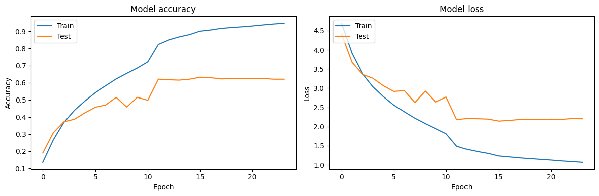
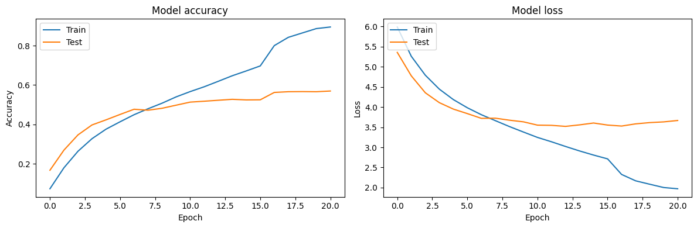

## Overview
This repository is a hands-on deep learning project focused on implementing, training, and benchmarking CNN architectures on **CIFAR-100**. The project transitions from **training foundational models from scratch** to leveraging **Transfer Learning** with modern pretrained networks. 

A central focus is analyzing training dynamics, including the trade-offs between model capacity, generalization, and the specific challenges of low-resolution image classification.

## Models & Strategy

### 1) Training from Scratch (Baseline)
To study the evolution of CNNs, the following were implemented:
- **ResNet-18**: Utilizing residual connections to stabilize deep optimization.
- **VGG-13**: Studying depth and capacity trade-offs through stacked 3×3 convolutions.
- **AlexNet**: A classic baseline to evaluate progress in CNN design.

### 2) Transfer Learning (Optimization)
- **EfficientNetV2**: Employed as a pretrained feature extractor to improve generalization and leverage robust representations learned from ImageNet.

## Dataset & Adaptive Pipeline
- **Dataset**: [CIFAR-100](https://www.cs.toronto.edu/~kriz/cifar.html) (100 classes, 50,000 training / 10,000 test images).
- **Preprocessing Pipeline**: 
  - **The 32×32 → 224×224 Trade-off**: Images were upscaled to align with standard ImageNet-style input requirements. While this ensures architectural compatibility, it acknowledges that upscaling does not recover lost spatial details but allows the model to leverage pretrained filters effectively.
  - **Normalization**: Pixel values rescaled to [0, 1] and normalized using mean/std statistics for stable training.

## Training Setup & Techniques
- **Mixed-Precision Training (16-bit)**: Implemented for VGG-13 to manage higher memory consumption and optimize training speed.
- **Dynamic Optimization**: Implemented **Early Stopping** and **ReduceLROnPlateau** (Learning Rate Scheduling) to manage convergence.
- **Metric**: Evaluated primarily via **Top-1 Validation Accuracy**.

## Results & Analysis

| Strategy | Architecture | Best Val Acc |
| :--- | :--- | :---: |
| **Transfer Learning** | **EfficientNetV2** | **77.39%** |
| From Scratch | ResNet-18 | 63.16% |
| From Scratch | VGG-13 | 57.03% |
| From Scratch | AlexNet | 56.97% |

**Key Insight:** Large-capacity models (like ResNet/VGG) trained from scratch on low-resolution images tend to **fit the training set too well**, leading to generalization gaps. **Transfer Learning** provides a superior inductive bias, allowing the network to generalize far better even with upscaled inputs.

---

## Performance Visualization

### EfficientNetV2 (Transfer Learning)

### ResNet-18

### VGG-13

### AlexNet

## Future Work
- **Fine-tuning**: Unfreezing top blocks of EfficientNetV2 with a **lower learning rate** to preserve pretrained features while adapting to CIFAR-100.
- **Advanced Augmentation**: Implementing MixUp or RandAugment to combat overfitting in from-scratch models.
- **Regularization**: Exploring Label Smoothing and Weight Decay tuning.

## Tech Stack
- Python
- TensorFlow / Keras
- Scikit-Learn (Model selection & splitting)
- Matplotlib
